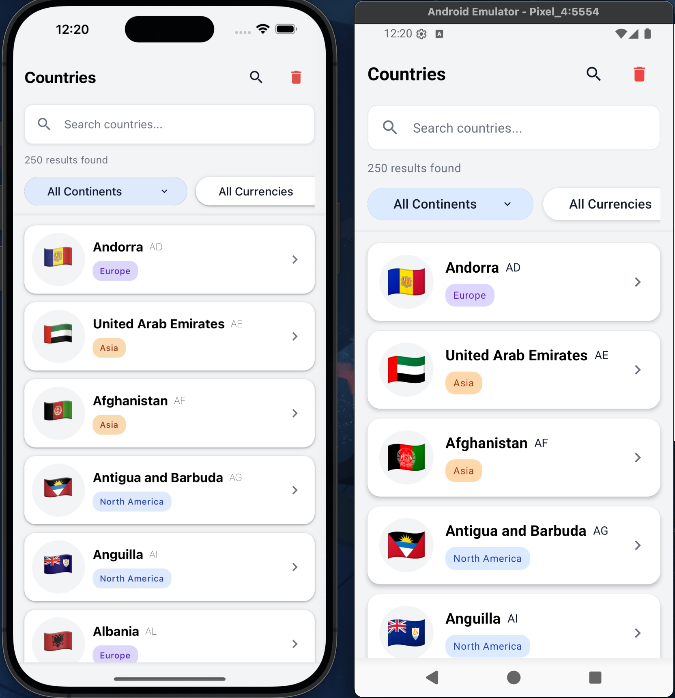
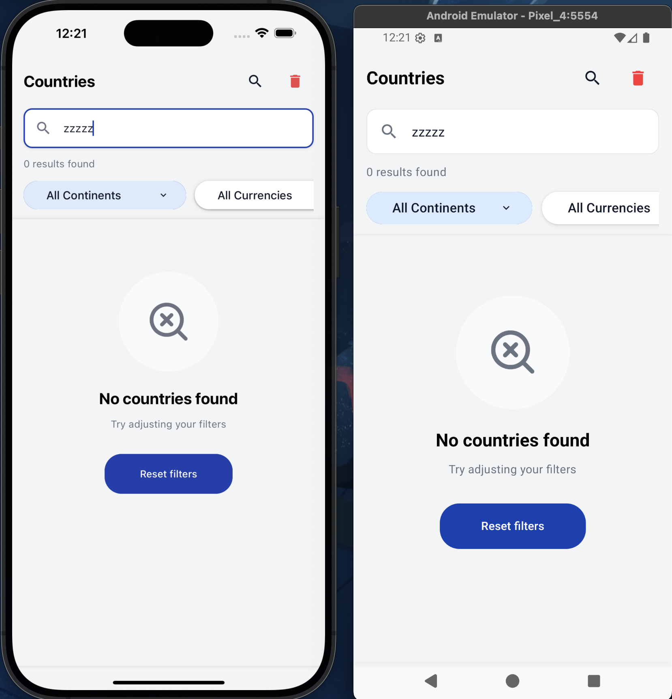
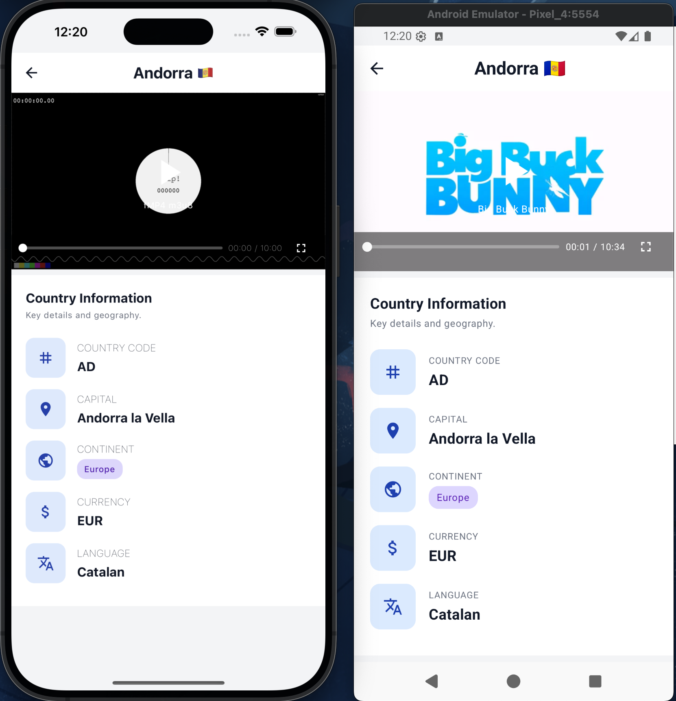

# Crehana's Technical Test: Mobile react-native
[](https://reactnative.dev)
[](https://reactjs.org)
[](https://www.typescriptlang.org)
[](https://www.apollographql.com/docs/react)
[](https://graphql.org)
[](https://zustand-demo.pmnd.rs)
[](https://reactnavigation.org)
[](https://callstack.github.io/react-native-paper)
[](https://react-hook-form.com)
[](https://shopify.github.io/flash-list)
[](https://github.com/mrousavy/react-native-mmkv)
[](https://github.com/react-native-video/react-native-video)
[](https://github.com/jquense/yup)
[](https://rxjs.dev)
[](https://jestjs.io)
[](https://nodejs.org)

I hope to meet and exceed your expectations. This React Native (0.83.0) project implements a feature-based architecture following SOLID principles and clean code practices. The application is structured around domain-driven design, where each feature (such as the country module) is organized into distinct layers: GraphQL queries and mutations, data models, custom hooks for business logic, reusable components, and screens.
The architecture prioritizes separation of concerns, with shared utilities, theme configurations, and common components abstracted into a dedicated shared module. State management is handled through Zustand with MMKV storage for persistence, while Apollo Client manages all GraphQL operations against the Countries API. The country feature includes comprehensive filtering capabilities (by name, continent, and currency), detailed country information views, and an integrated HLS video player component.

## Setup Environment
Project created with React Native CLI. [See official docs](https://reactnative.dev/docs/environment-setup) to set up the environment.

1. Install all dependencies with:
```bash
pnpm install
```

2. Rename `.env.example` to `.env`:
```bash
cp .env.example .env
```
Or manually rename the file from `.env.example` to `.env`

3. Install iOS pods using the custom script:
```bash
pnpm run ios-preBuild
```

4. Run Metro in another terminal tab (Optional):
```bash
pnpm start
```

5. Run in iOS simulator. You can also open Xcode and run 2 different schemas (Debug or Release). With this command you can run in debug mode:
```bash
pnpm run ios
```
Or use the custom simulator configuration:
```bash
pnpm run ios-custom
```

6. Run in Android simulator:
```bash
pnpm run android
```

7. If you want to run unit tests with coverage, use this command (optional):
```bash
pnpm run test
```

If you have any problems, these are my actual global versions:
```bash
node -v                -> v20.17.0
pnpm -v                -> (your version)
npx metro --version    -> 0.81.5
```

### Other commands:

1. Clean Android build:
```bash
pnpm run android-clean
```

2. Clean iOS build:
```bash
pnpm run ios-clean
```

3. Reset Metro cache:
```bash
pnpm run reset-cache
```

# Command tree for the files

```bash
├── App.tsx
├── Gemfile
├── Gemfile.lock
├── README.md
├── app.json
├── babel.config.js
├── coverage
│   ├── clover.xml
│   ├── coverage-final.json
│   ├── lcov-report
│   │   ├── base.css
│   │   ├── block-navigation.js
│   │   ├── favicon.png
│   │   ├── index.html
│   │   ├── prettify.css
│   │   ├── prettify.js
│   │   ├── sort-arrow-sprite.png
│   │   ├── sorter.js
│   │   └── src
│   │       ├── app
│   │       │   └── naigation
│   │       │       ├── MainNavigation.tsx.html
│   │       │       └── index.html
│   │       ├── features
│   │       │   ├── country
│   │       │   │   ├── components
│   │       │   │   │   ├── ContinentTag.tsx.html
│   │       │   │   │   ├── CountryCard.tsx.html
│   │       │   │   │   ├── EmptyState.tsx.html
│   │       │   │   │   ├── FiltersSelectorHome.tsx.html
│   │       │   │   │   ├── HeaderHome.tsx.html
│   │       │   │   │   ├── InfoCard.tsx.html
│   │       │   │   │   ├── MiniVideoContainer.tsx.html
│   │       │   │   │   ├── ModalFullVideo.tsx.html
│   │       │   │   │   ├── RenderLoadingSkeleton.tsx.html
│   │       │   │   │   ├── SearchInput.tsx.html
│   │       │   │   │   ├── index.html
│   │       │   │   │   └── index.ts.html
│   │       │   │   ├── graphql
│   │       │   │   │   ├── continents.mutation.ts.html
│   │       │   │   │   ├── countries.mutation.ts.html
│   │       │   │   │   ├── countryDetail.mutation.ts.html
│   │       │   │   │   ├── index.html
│   │       │   │   │   └── index.ts.html
│   │       │   │   ├── hooks
│   │       │   │   │   ├── index.html
│   │       │   │   │   ├── index.ts.html
│   │       │   │   │   ├── useDetailsCountry.ts.html
│   │       │   │   │   ├── useFilteredCountries.ts.html
│   │       │   │   │   ├── useFilters.ts.html
│   │       │   │   │   └── useSearchSync.ts.html
│   │       │   │   ├── index.html
│   │       │   │   ├── index.ts.html
│   │       │   │   ├── model
│   │       │   │   │   ├── continents.ts.html
│   │       │   │   │   ├── countries.ts.html
│   │       │   │   │   ├── countryDetail.ts.html
│   │       │   │   │   ├── index.html
│   │       │   │   │   └── index.ts.html
│   │       │   │   └── screens
│   │       │   │       ├── DetailsScreen.tsx.html
│   │       │   │       ├── HomeScreen.tsx.html
│   │       │   │       ├── index.html
│   │       │   │       └── index.ts.html
│   │       │   ├── index.html
│   │       │   └── index.ts.html
│   │       ├── index.html
│   │       ├── index.ts.html
│   │       └── shared
│   │           ├── components
│   │           │   ├── InputGeneric.tsx.html
│   │           │   ├── InputSelectPaper.tsx.html
│   │           │   ├── StandardWrapper.tsx.html
│   │           │   ├── TextGeneric.tsx.html
│   │           │   ├── index.html
│   │           │   └── index.ts.html
│   │           ├── graphql
│   │           │   ├── client
│   │           │   │   ├── auth-dummy-authenticated.ts.html
│   │           │   │   ├── index.html
│   │           │   │   └── index.ts.html
│   │           │   ├── index.html
│   │           │   ├── index.ts.html
│   │           │   └── links
│   │           │       ├── auth-http-link
│   │           │       │   ├── index.html
│   │           │       │   └── index.ts.html
│   │           │       ├── error-link
│   │           │       │   ├── index.html
│   │           │       │   └── index.ts.html
│   │           │       ├── index.html
│   │           │       ├── index.ts.html
│   │           │       └── logger-link
│   │           │           ├── index.html
│   │           │           └── index.ts.html
│   │           ├── hooks
│   │           │   ├── index.html
│   │           │   ├── index.ts.html
│   │           │   └── useDebouncedValue.ts.html
│   │           ├── index.html
│   │           ├── index.ts.html
│   │           ├── interfaces
│   │           │   ├── index.html
│   │           │   ├── index.ts.html
│   │           │   ├── inputGenericProps.ts.html
│   │           │   ├── inputSelectPaper.ts.html
│   │           │   ├── navigations.ts.html
│   │           │   └── textGeneric.ts.html
│   │           ├── store
│   │           │   ├── index.html
│   │           │   ├── index.ts.html
│   │           │   ├── manager
│   │           │   │   ├── countriesStore.ts.html
│   │           │   │   ├── index.html
│   │           │   │   ├── index.ts.html
│   │           │   │   └── interface
│   │           │   │       ├── countries.ts.html
│   │           │   │       ├── index.html
│   │           │   │       └── index.ts.html
│   │           │   └── mmkvStorage.ts.html
│   │           ├── theme
│   │           │   ├── colors.ts.html
│   │           │   ├── index.html
│   │           │   ├── index.ts.html
│   │           │   └── theme.ts.html
│   │           └── utils
│   │               ├── constants
│   │               │   ├── index.html
│   │               │   ├── index.ts.html
│   │               │   ├── phoneDimensions.ts.html
│   │               │   ├── skeleton.ts.html
│   │               │   └── videos-src.ts.html
│   │               ├── index.html
│   │               ├── index.ts.html
│   │               └── isIOS.ts.html
│   └── lcov.info
├── index.js
├── jest.config.js
├── jest.setup.js
├── metro.config.js
├── package.json
├── pnpm-lock.yaml
├── src
│   ├── app
│   │   └── naigation
│   │       └── MainNavigation.tsx
│   ├── features
│   │   ├── country
│   │   │   ├── components
│   │   │   │   ├── ContinentTag.tsx
│   │   │   │   ├── CountryCard.tsx
│   │   │   │   ├── EmptyState.tsx
│   │   │   │   ├── FiltersSelectorHome.tsx
│   │   │   │   ├── HeaderHome.tsx
│   │   │   │   ├── InfoCard.tsx
│   │   │   │   ├── MiniVideoContainer.tsx
│   │   │   │   ├── ModalFullVideo.tsx
│   │   │   │   ├── RenderLoadingSkeleton.tsx
│   │   │   │   ├── SearchInput.tsx
│   │   │   │   └── index.ts
│   │   │   ├── graphql
│   │   │   │   ├── __test__
│   │   │   │   │   ├── continents.mutation.test.ts
│   │   │   │   │   ├── countries.mutation.test.ts
│   │   │   │   │   └── countryDetail.mutation.test.ts
│   │   │   │   ├── continents.mutation.ts
│   │   │   │   ├── countries.mutation.ts
│   │   │   │   ├── countryDetail.mutation.ts
│   │   │   │   └── index.ts
│   │   │   ├── hooks
│   │   │   │   ├── __test__
│   │   │   │   │   ├── useDetailsCountry.test.ts
│   │   │   │   │   ├── useFilteredCountries.test.ts
│   │   │   │   │   ├── useFilters.test.ts
│   │   │   │   │   └── useSearchSync.test.ts
│   │   │   │   ├── index.ts
│   │   │   │   ├── useDetailsCountry.ts
│   │   │   │   ├── useFilteredCountries.ts
│   │   │   │   ├── useFilters.ts
│   │   │   │   └── useSearchSync.ts
│   │   │   ├── index.ts
│   │   │   ├── model
│   │   │   │   ├── continents.ts
│   │   │   │   ├── countries.ts
│   │   │   │   ├── countryDetail.ts
│   │   │   │   └── index.ts
│   │   │   └── screens
│   │   │       ├── DetailsScreen.tsx
│   │   │       ├── HomeScreen.tsx
│   │   │       ├── __test__
│   │   │       │   ├── DetailsScreen.test.tsx
│   │   │       │   └── HomeScreen.test.tsx
│   │   │       └── index.ts
│   │   └── index.ts
│   ├── index.ts
│   └── shared
│       ├── __mocks__
│       │   ├── env.ts
│       │   ├── globalMocks.ts
│       │   ├── graphql
│       │   │   ├── continentsMock.mutation.ts
│       │   │   ├── countriesMock.mutation.ts
│       │   │   ├── countryDetailMock.mutation.ts
│       │   │   └── index.ts
│       │   ├── index.ts
│       │   ├── react-native-paper.ts
│       │   └── store
│       │       ├── countriesStore.ts
│       │       ├── index.ts
│       │       ├── react-native-mmkv.ts
│       │       └── zustand.ts
│       ├── assets
│       │   ├── 1.2.png
│       │   ├── 1.png
│       │   └── 2.png
│       ├── components
│       │   ├── InputGeneric.tsx
│       │   ├── InputSelectPaper.tsx
│       │   ├── StandardWrapper.tsx
│       │   ├── TextGeneric.tsx
│       │   ├── __test__
│       │   │   ├── InputGeneric.test.tsx
│       │   │   └── InputSelectPaper.test.tsx
│       │   └── index.ts
│       ├── graphql
│       │   ├── client
│       │   │   ├── auth-dummy-authenticated.ts
│       │   │   └── index.ts
│       │   ├── index.ts
│       │   └── links
│       │       ├── auth-http-link
│       │       │   └── index.ts
│       │       ├── error-link
│       │       │   └── index.ts
│       │       ├── index.ts
│       │       └── logger-link
│       │           └── index.ts
│       ├── hooks
│       │   ├── index.ts
│       │   └── useDebouncedValue.ts
│       ├── index.ts
│       ├── interfaces
│       │   ├── env.d.ts
│       │   ├── index.ts
│       │   ├── inputGenericProps.ts
│       │   ├── inputSelectPaper.ts
│       │   ├── navigations.ts
│       │   └── textGeneric.ts
│       ├── store
│       │   ├── index.ts
│       │   ├── manager
│       │   │   ├── __test__
│       │   │   │   └── countriesStore.test.ts
│       │   │   ├── countriesStore.ts
│       │   │   ├── index.ts
│       │   │   └── interface
│       │   │       ├── countries.ts
│       │   │       └── index.ts
│       │   └── mmkvStorage.ts
│       ├── theme
│       │   ├── colors.ts
│       │   ├── index.ts
│       │   └── theme.ts
│       └── utils
│           ├── constants
│           │   ├── index.ts
│           │   ├── phoneDimensions.ts
│           │   ├── skeleton.ts
│           │   └── videos-src.ts
│           ├── index.ts
│           └── isIOS.ts
└── tsconfig.json

64 directories, 209 files
```

## Link-video-demo-app

[](https://youtu.be/Y4CUh_ywlec)

## App Screenshots


|                                 |                  Mobile                    |
| :------------------------------:| :-----------------------------------------:|
|               Home              |                |
|             Home Empty          |              |
|               Details           |                |

## Unit Test Report

```bash
-----------------------------------------|---------|----------|---------|---------|--------------------------------------------
File                                     | % Stmts | % Branch | % Funcs | % Lines | Uncovered Line #s                          
-----------------------------------------|---------|----------|---------|---------|--------------------------------------------
All files                                |   59.28 |    49.79 |   47.45 |   60.52 |                                            
 src                                     |       0 |        0 |       0 |       0 |                                            
  index.ts                               |       0 |        0 |       0 |       0 |                                            
 src/app/naigation                       |       0 |      100 |       0 |       0 |                                            
  MainNavigation.tsx                     |       0 |      100 |       0 |       0 | 7-10                                       
 src/features                            |       0 |        0 |       0 |       0 |                                            
  index.ts                               |       0 |        0 |       0 |       0 |                                            
 src/features/country                    |       0 |        0 |       0 |       0 |                                            
  index.ts                               |       0 |        0 |       0 |       0 |                                            
 src/features/country/components         |   46.93 |        0 |       0 |   46.93 |                                            
  ContinentTag.tsx                       |   42.85 |        0 |       0 |   42.85 | 26-36                                      
  CountryCard.tsx                        |   33.33 |      100 |       0 |   33.33 | 21-27,88-90                                
  EmptyState.tsx                         |      50 |        0 |       0 |      50 | 13-15                                      
  FiltersSelectorHome.tsx                |      50 |      100 |       0 |      50 | 16-18                                      
  HeaderHome.tsx                         |      40 |      100 |       0 |      40 | 9-19                                       
  InfoCard.tsx                           |      60 |        0 |       0 |      60 | 24,54                                      
  MiniVideoContainer.tsx                 |   66.66 |        0 |       0 |   66.66 | 58                                         
  ModalFullVideo.tsx                     |   66.66 |        0 |       0 |   66.66 | 66                                         
  RenderLoadingSkeleton.tsx              |      50 |      100 |       0 |      50 | 6-8                                        
  SearchInput.tsx                        |      40 |        0 |       0 |      40 | 14-17                                      
  index.ts                               |       0 |        0 |       0 |       0 |                                            
 src/features/country/graphql            |     100 |      100 |     100 |     100 |                                            
  continents.mutation.ts                 |     100 |      100 |     100 |     100 |                                            
  countries.mutation.ts                  |     100 |      100 |     100 |     100 |                                            
  countryDetail.mutation.ts              |     100 |      100 |     100 |     100 |                                            
  index.ts                               |       0 |        0 |       0 |       0 |                                            
 src/features/country/hooks              |   82.94 |    72.16 |   84.09 |   83.33 |                                            
  index.ts                               |       0 |        0 |       0 |       0 |                                            
  useDetailsCountry.ts                   |    70.4 |    60.78 |   68.18 |   71.13 | 90-114,120-121,132,160,166-181,191-194,198 
  useFilteredCountries.ts                |     100 |      100 |     100 |     100 |                                            
  useFilters.ts                          |     100 |       75 |     100 |     100 | 17,26-32,40,43                             
  useSearchSync.ts                       |     100 |    83.33 |     100 |     100 | 20,33                                      
 src/features/country/model              |       0 |        0 |       0 |       0 |                                            
  continents.ts                          |       0 |        0 |       0 |       0 |                                            
  countries.ts                           |       0 |        0 |       0 |       0 |                                            
  countryDetail.ts                       |       0 |        0 |       0 |       0 |                                            
  index.ts                               |       0 |        0 |       0 |       0 |                                            
 src/features/country/screens            |      80 |      100 |   55.55 |      80 |                                            
  DetailsScreen.tsx                      |      90 |      100 |      75 |      90 | 72                                         
  HomeScreen.tsx                         |      70 |      100 |      40 |      70 | 49-54                                      
  index.ts                               |       0 |        0 |       0 |       0 |                                            
 src/shared                              |       0 |        0 |       0 |       0 |                                            
  index.ts                               |       0 |        0 |       0 |       0 |                                            
 src/shared/components                   |   47.36 |    65.11 |   43.75 |   48.57 |                                            
  InputGeneric.tsx                       |   66.66 |     87.5 |      75 |   66.66 | 63-64                                      
  InputSelectPaper.tsx                   |   68.42 |       70 |      50 |      75 | 45-47,102                                  
  StandardWrapper.tsx                    |      25 |        0 |       0 |      25 | 11-18                                      
  TextGeneric.tsx                        |       0 |        0 |       0 |       0 | 20-128                                     
  index.ts                               |       0 |        0 |       0 |       0 |                                            
 src/shared/graphql                      |       0 |        0 |       0 |       0 |                                            
  index.ts                               |       0 |        0 |       0 |       0 |                                            
 src/shared/graphql/client               |     100 |      100 |     100 |     100 |                                            
  auth-dummy-authenticated.ts            |     100 |      100 |     100 |     100 |                                            
  index.ts                               |       0 |        0 |       0 |       0 |                                            
 src/shared/graphql/links                |       0 |        0 |       0 |       0 |                                            
  index.ts                               |       0 |        0 |       0 |       0 |                                            
 src/shared/graphql/links/auth-http-link |   33.33 |      100 |       0 |   33.33 |                                            
  index.ts                               |   33.33 |      100 |       0 |   33.33 | 7-9                                        
 src/shared/graphql/links/error-link     |    7.69 |        0 |       0 |    8.33 |                                            
  index.ts                               |    7.69 |        0 |       0 |    8.33 | 8-29                                       
 src/shared/graphql/links/logger-link    |      10 |        0 |       0 |      10 |                                            
  index.ts                               |      10 |        0 |       0 |      10 | 5-23                                       
 src/shared/hooks                        |    12.5 |        0 |       0 |    12.5 |                                            
  index.ts                               |       0 |        0 |       0 |       0 |                                            
  useDebouncedValue.ts                   |    12.5 |        0 |       0 |    12.5 | 4-17                                       
 src/shared/interfaces                   |       0 |        0 |       0 |       0 |                                            
  index.ts                               |       0 |        0 |       0 |       0 |                                            
  inputGenericProps.ts                   |       0 |        0 |       0 |       0 |                                            
  inputSelectPaper.ts                    |       0 |        0 |       0 |       0 |                                            
  navigations.ts                         |       0 |        0 |       0 |       0 |                                            
  textGeneric.ts                         |       0 |        0 |       0 |       0 |                                            
 src/shared/store                        |   66.66 |      100 |   33.33 |   66.66 |                                            
  index.ts                               |       0 |        0 |       0 |       0 |                                            
  mmkvStorage.ts                         |   66.66 |      100 |   33.33 |   66.66 | 15-18                                      
 src/shared/store/manager                |    8.33 |        0 |   14.28 |     9.3 |                                            
  countriesStore.ts                      |    8.33 |        0 |   14.28 |     9.3 | 34-134,141                                 
  index.ts                               |       0 |        0 |       0 |       0 |                                            
 src/shared/store/manager/interface      |       0 |        0 |       0 |       0 |                                            
  countries.ts                           |       0 |        0 |       0 |       0 |                                            
  index.ts                               |       0 |        0 |       0 |       0 |                                            
 src/shared/theme                        |      75 |      100 |       0 |     100 |                                            
  colors.ts                              |     100 |      100 |     100 |     100 |                                            
  index.ts                               |       0 |        0 |       0 |       0 |                                            
  theme.ts                               |   66.66 |      100 |       0 |     100 |                                            
 src/shared/utils                        |      50 |      100 |       0 |      50 |                                            
  index.ts                               |       0 |        0 |       0 |       0 |                                            
  isIOS.ts                               |      50 |      100 |       0 |      50 | 4                                          
 src/shared/utils/constants              |     100 |      100 |     100 |     100 |                                            
  index.ts                               |       0 |        0 |       0 |       0 |                                            
  phoneDimensions.ts                     |     100 |      100 |     100 |     100 |                                            
  skeleton.ts                            |     100 |      100 |     100 |     100 |                                            
  videos-src.ts                          |     100 |      100 |     100 |     100 |                                            
-----------------------------------------|---------|----------|---------|---------|--------------------------------------------

Test Suites: 12 passed, 12 total
Tests:       86 passed, 86 total
Snapshots:   0 total
Time:        1.948 s
Ran all test suites.
```